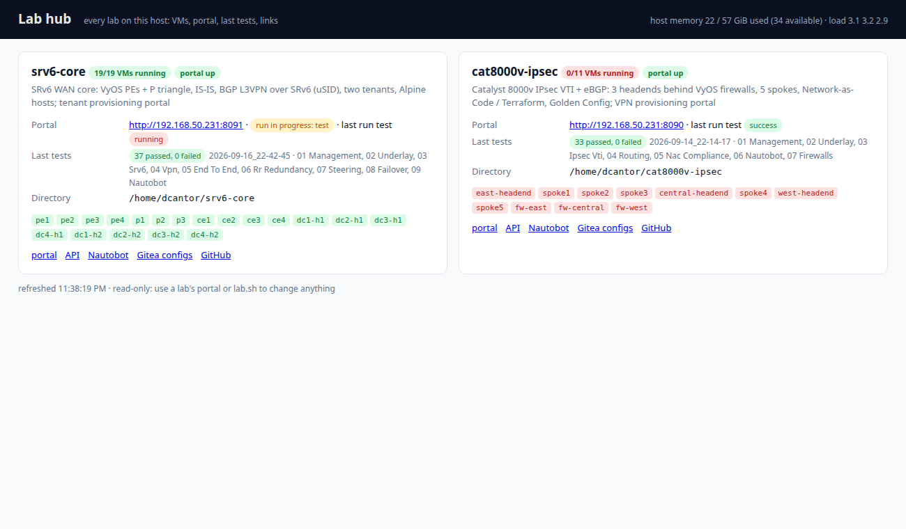

# lab-portal — what the lab portals share, and the hub in front of them

Two labs on the same host have their own provisioning portal: the **VPN portal** of
[cat8000v-ipsec](https://github.com/dcantor/cat8000v-ipsec) (port 8090) and the **tenant portal** of
[srv6-core](https://github.com/dcantor/srv6-core) (port 8091). This package holds the parts they have in common, and a
small **hub** page that fronts every lab.

## `labportal` (Python package)
- `RunBase` — a pipeline run: ordered steps from `plan()`, `do_<step>()` methods, a streamed log, persistence to
  `runs/<id>.json`, failure handling, and **resume** (successful steps of a failed / interrupted run are carried over).
  `sh()` streams a subprocess into the log; `record_tests()` parses a Robot Framework result folder.
- `RunRegistry` — the live runs, one at a time; `install_runs_api(app, registry, resume_factory)` mounts
  `GET /api/runs`, `GET /api/runs/{id}?since=`, `POST /api/runs/{id}/resume` and the startup hook that marks runs
  interrupted by a restart. `POST /api/runs` stays in each portal — its validation is lab-specific.
- `parse_robot()` — Robot `output.xml` → suites / tests / pass / fail.

```bash
pip install git+https://github.com/dcantor/lab-portal      # or: pip install -e ~/lab-portal
```
```python
from labportal import RunBase, RunRegistry, install_runs_api
class Run(RunBase):
    STEP_TITLES = {"validate": "Validate", "apply": "Apply", "test": "Robot Framework tests"}
    EXTRA = {"tenant": "tenant"}                     # extra fields in to_dict()
    def plan(self): return ["validate", "apply", "test"]
    def do_validate(self, step): ...
registry = RunRegistry(RUNS_DIR)
install_runs_api(app, registry, resume_factory=lambda d: Run(d["mode"], d.get("options"), resume_of=d))
```

## The hub (`lab-hub`, port 8088)
One page: every lab with its VMs (running / total, from `lab.sh status`), the portal's health and last run, the last
Robot result (from `results/latest`), host memory and load, and links to the portal, its API, Nautobot, the Gitea
configuration repo and GitHub. Read-only by design — it never starts, stops or changes a lab.

Labs are declared in `~/.config/lab-hub/labs.json` (see `labs.example.json`); `lab-hub.service` is the systemd user unit.



## Monitoring (`monitoring/`)
Prometheus + VictoriaMetrics + Grafana for every lab, deployed on the NMS with `monitoring/deploy.sh`. Portals expose
`/api/sd` (service discovery) and `/metrics`; `labportal.metrics` has the exposition helper and the run / test metrics
common to every portal. See [monitoring/README.md](monitoring/README.md). The hub links to Grafana per lab and to the
Prometheus targets / alerts.
