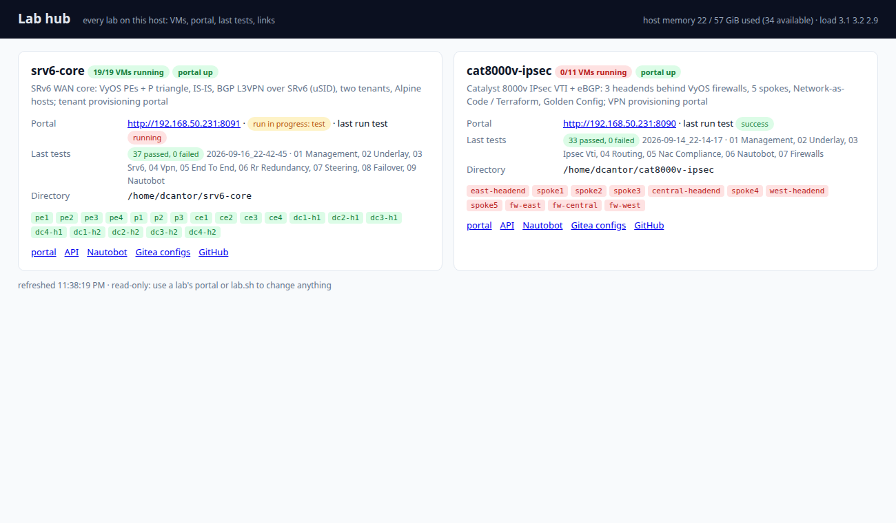

# lab-portal — what the lab portals share, and the hub in front of them

Two labs on the same host have their own provisioning portal: the **VPN portal** of
[cat8000v-ipsec](https://github.com/dcantor/cat8000v-ipsec) (port 8090) and the **tenant portal** of
[srv6-core](https://github.com/dcantor/srv6-core) (port 8091). This package holds the parts they have in common, and a
small **hub** page that fronts every lab.

## `labportal` (Python package)
- `RunBase` — a pipeline run: ordered steps from `plan()`, `do_<step>()` methods, a streamed log, persistence to
  `runs/<id>.json`, failure handling, and **resume** (successful steps of a failed / interrupted run are carried over).
  `sh()` streams a subprocess into the log; `record_tests()` parses a Robot Framework result folder.
- `RunRegistry` — the live runs, one at a time; `install_runs_api(app, registry, resume_factory)` mounts
  `GET /api/runs`, `GET /api/runs/{id}?since=`, `POST /api/runs/{id}/resume` and the startup hook that marks runs
  interrupted by a restart. `POST /api/runs` stays in each portal — its validation is lab-specific.
- `parse_robot()` — Robot `output.xml` → suites / tests / pass / fail.

```bash
pip install git+https://github.com/dcantor/lab-portal      # or: pip install -e ~/lab-portal
```
```python
from labportal import RunBase, RunRegistry, install_runs_api
class Run(RunBase):
    STEP_TITLES = {"validate": "Validate", "apply": "Apply", "test": "Robot Framework tests"}
    EXTRA = {"tenant": "tenant"}                     # extra fields in to_dict()
    def plan(self): return ["validate", "apply", "test"]
    def do_validate(self, step): ...
registry = RunRegistry(RUNS_DIR)
install_runs_api(app, registry, resume_factory=lambda d: Run(d["mode"], d.get("options"), resume_of=d))
```

## The hub (`lab-hub`, port 8088)
One page: the host's **CPU, memory and disk** (busy percentage and load, memory with swap, every filesystem the labs
live on — each with a bar), then every lab with its VMs (running / total, from `lab.sh status`), the portal's health and
last run, the last Robot result (from `results/latest`), and links to the portal, its API, Nautobot, the Gitea
configuration repo and GitHub.

**Power**: each lab can be brought up or shut down from here — the whole lab with the two buttons, or any single VM by
clicking its name. Every one of them asks first, saying what it will do and what it costs ("Shut down host-spoke2 in
cat8000v-ipsec? It is running. A router saves its configuration first…"). The hub runs that lab's own `lab.sh up|down [node…]`, so a shutdown still saves each router's
configuration first, and the page shows what the command printed. One operation at a time per lab; the whole lab needs
an explicit confirmation (`confirm: true` on the API); and a shutdown is refused while the lab's portal has a run in
progress, so nothing pulls the rug from under a Terraform apply (`force: true` overrides). `LAB_HUB_POWER=off` makes
the hub read-only again. Everything else about a lab — provisioning, day-2 changes, tests — stays in its own portal.

    POST /api/labs/cat8000v-ipsec/power  {"action": "up", "confirm": true}
    POST /api/labs/cat8000v-ipsec/power  {"action": "down", "nodes": ["spoke1"]}
    GET  /api/labs/cat8000v-ipsec/power                     # the current or last operation, with lab.sh's output

**Shared services.** A card above the labs shows the NMS VM and each service on it, with a link to each and what it is
used for: Prometheus, VictoriaMetrics, VictoriaLogs, Grafana, Gitea and Nautobot.
- It shows whether each service answers, and states plainly when the NMS is off, because then nothing alerts, CI does not
  run and Nautobot is unreachable.
- It can start the NMS, waiting until every service answers, or shut it down cleanly.
- The services come from `~/.config/lab-hub/services.json`, or the built-in defaults (`labportal/hub/shared.py`).

**CI.** For a lab with a `ci` entry in `labs.json`, its card shows:
- the latest run on the local Gitea, with each job's result and the test counts CI committed back to GitHub;
- a strip of the last six runs;
- the commits CI has not tested yet, and when the mirror last synced.

**▶ Run CI** syncs the mirror from GitHub now, or dispatches the workflow on `main` when there is nothing new.

**■ Stop CI** stops the running job carefully. Gitea's own cancel kills the job outright, so Robot's teardowns never run.
The hub instead kills the step's shells, so nothing is committed back, and gives Robot one interrupt, so every teardown
runs and the lab is left as the tests found it.

**Safe power control.** Every power operation, from a button or the scheduler, is checked before it runs.
- **Memory.** Starting VMs needs the sum of their libvirt memory sizes, and the host must have that available with 2 GiB to
  spare (`LAB_HUB_RESERVE_GIB`). Otherwise the hub says how much is missing and asks before going ahead. If a lab's VMs
  cannot be read, its need is reported as unknown rather than zero.
- **Dependencies.** Every lab depends on the NMS (soft: monitoring, CI, backups, Nautobot), and on any lab whose VMs it
  attaches. That second kind is read from its `lab.conf` `EXT_LAB` entries, so it follows whether srv6-core has the IPsec
  headends attached.
- Starting a lab offers to start what it depends on first. Shutting one down, or the NMS, names the running labs that
  need it.
- Each card shows the lab's total memory and its dependencies. `GET /api/labs/{name}/plan?action=up|down` returns the
  same checks without changing anything.

**Schedules and idle shutdown.** Per lab, from the card's Schedule line:
- start and stop times on chosen days, and shut down after N idle hours;
- idle means no start, portal run, CI run or "I'm using it" press for that long. A lab with a portal or CI run in
  progress is never idle.
- Scheduled actions go through the same checks. What the scheduler did, or why it skipped, is shown on the card.
- Stored in `~/.config/lab-hub/schedules.json`; state is in `~/.local/state/lab-hub/state.json`.

**Sign-in.** Every page and API of the hub needs a sign-in, because it can power labs, the NMS and CI.
- Users are stored in `~/.config/lab-hub/auth.json` (mode 0600) as salted PBKDF2-SHA256 hashes, never the passwords
  themselves.
- On the first start the file is created with the user **admin / admin**. Change it with `lab-hub-passwd`; the same
  command adds users (`lab-hub-passwd <user>`).
- A sign-in sets a signed session cookie for 12 hours (`LAB_HUB_SESSION_HOURS`). It is HttpOnly and SameSite=Strict.
- Pages without a session go to `/login`; API calls get 401.
- Five failed attempts from one address lock it out for five minutes.
- `LAB_HUB_AUTH=off` turns sign-in off, for a trusted single-user machine only.

Labs are declared in `~/.config/lab-hub/labs.json` (see `labs.example.json`); `lab-hub.service` is the systemd user unit.



## Monitoring (`monitoring/`)
Prometheus + VictoriaMetrics + Grafana for every lab, deployed on the NMS with `monitoring/deploy.sh`. Portals expose
`/api/sd` (service discovery) and `/metrics`; `labportal.metrics` has the exposition helper and the run / test metrics
common to every portal; `labportal.grafana` posts annotations (every run is a region on the dashboards); VyOS nodes push
Telegraf metrics into VictoriaMetrics and syslog into VictoriaLogs, where vmalert turns routing-daemon log lines into
alerts. See
[monitoring/README.md](monitoring/README.md). The hub links to Grafana per lab and to the
Prometheus targets / alerts.

## `lab-mcp` — the labs as tools for an AI operator
`labportal/mcp/server.py` (`pip install -e ".[mcp]"`, entry point `lab-mcp`, stdio) exposes 19 read-only tools over the
labs: state, inventory, show / shell commands on routers and hosts, the ping matrix, the portal's live view, PromQL on
VictoriaMetrics, LogsQL on VictoriaLogs (syslog and flows), alerts, Grafana events, Nautobot GraphQL, intended vs
running configuration drift, and the test suites. `vyos_configure` is refused unless `LAB_MCP_ALLOW_WRITE=1`; every
command and change is audited in `~/.config/lab-hub/mcp-audit.jsonl`. See `srv6-core/docs/ai-ops.md` for the setup,
the fault-injection drill and a worked diagnosis.
